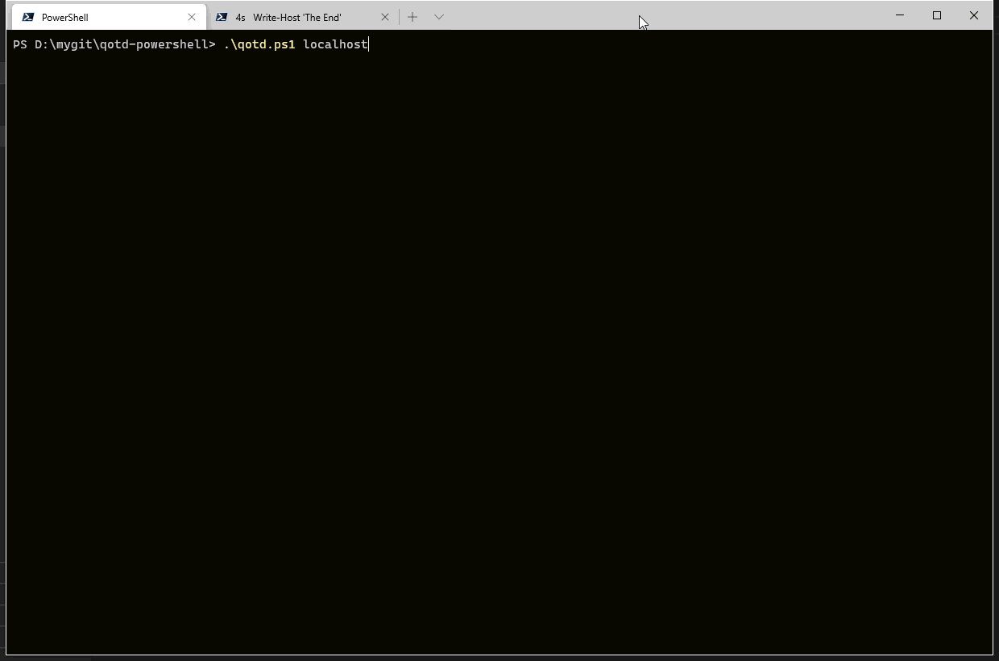

# qotd-powershell
Powershell version of Quote Of the Day microservice

## Demo

Start the qotd service in one tab.
Use `Invoke-RestMethod` to hit the endpoints in the other tab.



## Run it in Docker

```powershell
docker build --tag qotd:1.0 .
docker run -d -p 8081:8081 qotd:1.0
```

Try it:

```powershell
Invoke-Restmethod http://localhost:8081/
Invoke-Restmethod http://localhost:8081/writtenin
Invoke-Restmethod http://localhost:8081/version
Invoke-Restmethod http://localhost:8081/quotes
Invoke-Restmethod http://localhost:8081/quotes/2
Invoke-Restmethod http://localhost:8081/quotes/random
```